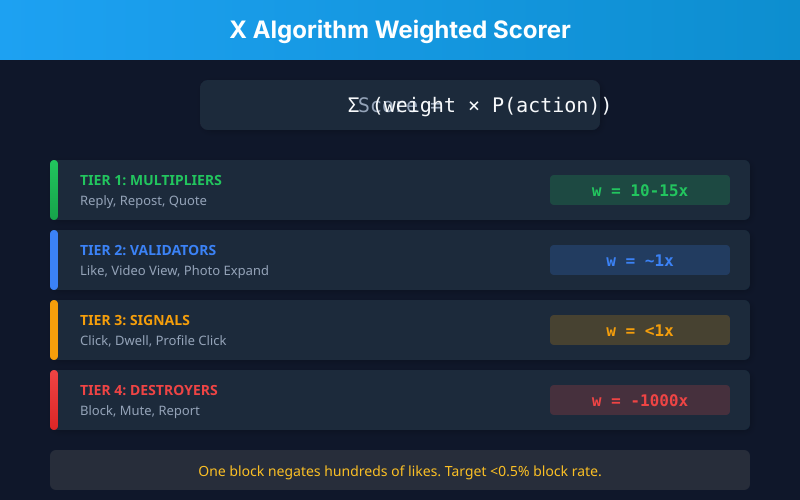

# X Algorithm Optimizer

**Reverse-engineered from X's actual codebase. Not guesses. Not theories. The real mechanics.**

[](https://twitter.com/themattberman)
[](https://bigplayers.co)

---

## The Game Changed in 2026

X abandoned hashtag matching and follower counts. The new system is **fully neural**:

<p align="center">
  
</p>

**Translation:** The algorithm literally reads your posts with an LLM and predicts exactly how users will engage. Gaming hashtags is dead. Alignment is everything.

---

## The Weighted Scorer (This Is How You Win)

Every post gets a score. Here's the formula:

<p align="center">
  
</p>

### The Math That Changes Everything

**Good post:**
```
P(reply)=0.15, P(like)=0.08, P(repost)=0.02, P(block)=0.001
Score = (15×0.15) + (1×0.08) + (12×0.02) + (-1000×0.001) = +1.57 ✓
```

**Rage-bait post:**
```
P(reply)=0.25, P(like)=0.05, P(repost)=0.03, P(block)=0.02
Score = (15×0.25) + (1×0.05) + (12×0.03) + (-1000×0.02) = -15.84 ✗
```

**The rage-bait got MORE engagement but scored WORSE.** The 2% block rate destroyed it.

---

## The 7 Mechanics That Control Your Reach

```
┌────────────────────────────────────────────────────────────────────────┐
│                    THE SEVEN ALPHA MECHANICS                           │
├────────────────────────────────────────────────────────────────────────┤
│                                                                        │
│  1. CANDIDATE ISOLATION        Posts scored independently, not curved  │
│  2. AUTHOR DIVERSITY PENALTY   0.3-0.7x penalty per consecutive post  │
│  3. NEGATIVE SIGNAL ASYMMETRY  Blocks weighted 1000x vs likes         │
│  4. MULTIMODAL BONUS           Media adds probability terms           │
│  5. GROK SEMANTIC READING      LLM detects spam, mismatch, tone       │
│  6. TWO-TOWER RETRIEVAL        User×Item vectors for discovery        │
│  7. TIME DECAY                 Exponential decay after 24-48h         │
│                                                                        │
└────────────────────────────────────────────────────────────────────────┘
```

---

## Cheat Sheet (Save This)

<p align="center">
  
</p>

<details>
<summary><b>Text version (click to expand)</b></summary>

### DO
- **Maximize P(reply):** Questions, fill-blanks, "hot take + nuance"
- **Always include media:** Adds P(video_view) + P(photo_expand) to your score
- **Space posts 4-6+ hours:** Author diversity penalty compounds
- **Post when audience is active:** Time decay is exponential
- **Build a concentrated niche:** Strengthens your User Tower embedding

### DON'T
- **Irrelevant hashtags:** Grok detects semantic mismatch → spam signal
- **Rage-bait:** High blocks destroy score even with high engagement
- **Link-only posts:** Zero media probability terms
- **Posting sprees:** 3rd post in an hour = ~10% reach of 1st
- **Engagement pods:** Grok detects coordination patterns

### TARGET
**< 0.5% block rate.** Above 1% = systematic demotion.

</details>

---

## High P(Reply) Patterns That Work

These patterns maximize the highest-weighted engagement signal:

| Pattern | Example | Why It Works |
|---------|---------|--------------|
| **Open question** | "What's your biggest [X] failure?" | Demands specific experience |
| **Fill-in-the-blank** | "The most underrated skill is ___" | Low friction to complete |
| **Intentional incompleteness** | List with obvious gap | People can't resist adding |
| **Nuanced controversy** | "Hot take: [X]. But here's the nuance..." | Invites debate, reduces blocks |
| **Correctability** | Slightly wrong statement | Experts will correct you |

**Anti-patterns:** Rhetorical questions, perfect statements, closed conclusions

---

## Content Optimization Flow

```
                        ┌─────────────────┐
                        │ What's your     │
                        │ goal?           │
                        └────────┬────────┘
                                 │
          ┌──────────┬───────────┼───────────┬──────────┐
          ▼          ▼           ▼           ▼          ▼
     ┌────────┐ ┌────────┐ ┌────────┐ ┌────────┐
     │ Max    │ │Engage- │ │Follower│ │ Safe   │
     │ Reach  │ │ment    │ │Growth  │ │Growth  │
     └───┬────┘ └───┬────┘ └───┬────┘ └───┬────┘
         │          │          │          │
         │   Optimize for:     │          │
         │   P(repost)  P(reply)  P(profile)  Low P(block)
         │          │          │          │
         └──────────┴──────────┴──────────┘
                        │
                        ▼
              ┌─────────────────┐
              │ Apply reply     │
              │ optimization    │
              └────────┬────────┘
                       │
                       ▼
              ┌─────────────────┐
              │ Add media       │
              │ (image/video)   │
              └────────┬────────┘
                       │
                       ▼
              ┌─────────────────┐
              │ Negative signal │
              │ scan (<0.5%     │
              │ block rate?)    │
              └────────┬────────┘
                       │
            ┌──────────┴──────────┐
            ▼                     ▼
       ┌────────┐           ┌────────┐
       │  POST  │           │ Revise │
       └────────┘           └───┬────┘
                                │
                                └──► (back to scan)
```

---

## Platform Quick Reference

| Element | Optimal | Why |
|---------|---------|-----|
| Characters | 71-100 (max 280) | No "Show more" friction |
| Hashtags | 0-1, semantically matched | Grok detects mismatch |
| Images | 1200×675px or vertical | Full preview; vertical forces expand |
| Video | <2:20, hook in 3s, captioned | Autoplay; 80% watch muted |
| Media source | Native upload only | Links don't trigger media P() |

---

## Installation (Claude Code Skill)

This is a **Claude Code skill** that gives Claude deep knowledge of X's algorithm mechanics.

### Install globally:

```bash
# Clone the repo
git clone https://github.com/themattberman/x-algo-skill.git

# Symlink to Claude Code skills directory
ln -s $(pwd)/x-algo-skill ~/.claude/skills/x-algorithm-optimizer
```

### Use it:

Once installed, Claude will automatically use this skill when you ask about:
- X/Twitter optimization
- Post performance debugging
- Algorithm mechanics
- Content strategy for reach

Or invoke directly: `/x-algorithm-optimizer`

---

## What's Included

```
x-algo-skill/
├── SKILL.md                      # Main skill file
├── README.md                     # You're reading it
├── references/
│   ├── phoenix-architecture.md   # Deep dive: Two-Tower, Grok, embeddings
│   ├── weighted-scorer.md        # Complete weight math + examples
│   └── post-templates.md         # 12+ proven formats
└── scripts/
    └── analyze_x_post.py         # Score posts against the algorithm
```

---

## The Meta-Strategy

**Old paradigm:** Game the algorithm (hashtags, timing, pods)

**New paradigm:** Align with the neural network's objective function

The algorithm optimizes for:
1. **Conversation** — P(reply) weighted highest
2. **Network extension** — P(repost), P(quote)
3. **User satisfaction** — Negative signals weighted catastrophically
4. **Semantic relevance** — Grok reads everything

**Your strategy:** Create content that genuinely maximizes these. The era of manipulation is over. The era of alignment has begun.

---

## About

Created by **[@themattberman](https://twitter.com/themattberman)** on X.

I write about AI, tech, and business at **[Big Players](https://bigplayers.co)** — a newsletter for people building the future.

Need help with AI strategy? **[Emerald Digital](https://emerald.digital)** — we help companies leverage AI to grow.

---

## License

MIT — Use it, share it, build on it.

---

<p align="center">
  <b>Star this repo if it helped you.</b><br>
  <a href="https://twitter.com/themattberman">Follow @themattberman for more</a>
</p>
