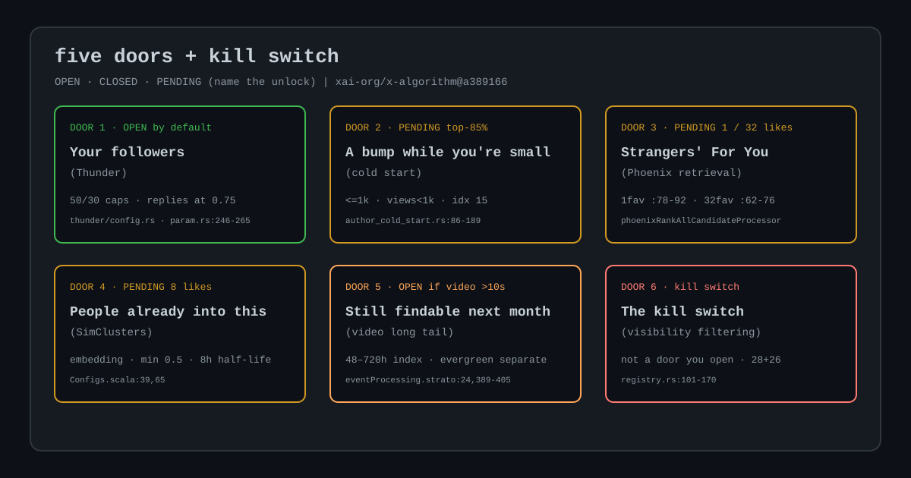
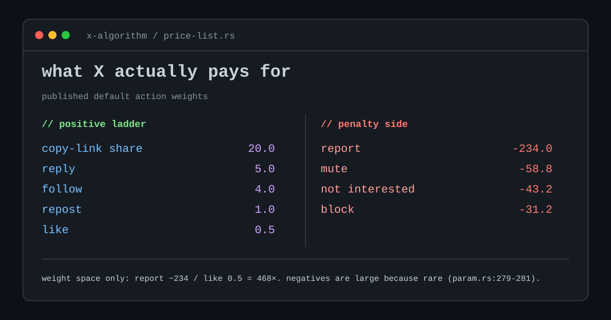
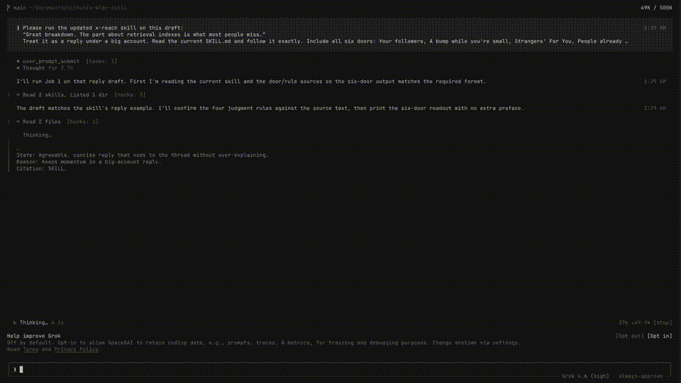

# X Reach Check

[](LICENSE)




Will this post get seen? Paste it and you get five doors that can put this in a feed — your followers and four stranger paths — plus the kill switch that can void them, closed ones first, plus the one edit that reopens the door that matters. Every call is a yes or no in X's published code, cited to the line.

## Six behavior changes

Citations: `xai-org/x-algorithm@a389166`.

1. **Write the post someone would copy and send.**
   Copy-link is weighted 20.0. A follow is weighted 4.0. A like is 0.5. Continuous dwell is 0.004. Binary dwell is off at 0.0. Profile click is the true zero. The weight on a copy-link share is 40x the weight on a like. Those weights multiply a predicted chance this viewer does the thing, and the file says the sizes reflect how rare the action is, not an exchange rate in real hearts. (`home-mixer/params/param.rs:279-281, 282, 311-316, 325-330, 331, 345-350, 375-380`)

2. **Write originals that a mutual would actually reply to.**
   When someone who follows you back sees a post you wrote, the reply term on that view jumps from 5 to 20. That is the biggest boost in the file, and it is the reply term only. It is not the whole post counting more. Replies and reposts get none of it. (`home-mixer/params/param.rs:284-289`; `home-mixer/scorers/ranking_scorer.rs:180-193`)

3. **If you want strangers, post an original.**
   A reply never enters the stranger index. Neither does a repost or a community post. Out-of-network replies get dropped before scoring. Even your own followers see a reply or a repost at 0.75 of the usual weight. Replies keep a relationship. They do not find you a new one. (`phoenix-rankall-strato/columns/phoenix_rank_all/phoenixRankAllCandidateProcessor.strato:441-446`; `home-mixer/filters/oon_retweet_reply_filter.rs:13-18`; `home-mixer/params/param.rs:246-251, 260-265`)

4. **Don't drop three posts into one scroll.**
   Your second post in the same person's refresh starts a third weaker (keeps 62.5%). Your third keeps 43.75%. Keep stacking and it floors at 0.25. This is per request, per person, inside one refresh. Three posts in a day, in different scrolls, do not trigger it. Three posts into one scroll do. (`home-mixer/scorers/ranking_scorer.rs:614-616`; `home-mixer/params/param.rs:222-239`)

5. **If it needs to live past Tuesday, make it video. Longer than 10 seconds.**
   Text drops out of retrieval in 24 to 48 hours. Video stays retrievable for 48 / 96 / 168 / 336 / 720 hours when duration is **strictly greater than** 10,000 ms — exactly 10,000 ms is also out (`phoenix-rankall-strato/lib/eventProcessing.strato:24, 389-405`). That duration floor gates the `video` / `nsfw_video` windows only. Evergreen video can stay 5 years; the published evergreen writers check media type only (no duration test), and the job that promotes a post to evergreen is not in the repo (`phoenix-rankall/src/config/mod.rs:139-156`). Separately, VQV **weight** credit also requires duration > 10,000 ms (`home-mixer/params/param.rs:677-682`) — weight credit, not the index gate.

6. **Treat one bad label like it can close every stranger door.**
   28 rules run on everybody. 26 more run on people who do not follow you. A labeled post can take a top-50 slot and then vanish (`visibility-filtering/rules/registry.rs:101-170`). An UNSAFE URL writes four drop labels at once, and a verdict change relabels old posts (`botmaker-rules/scarecrow/bot/rtf_tweets_on_unsafe_verdict.bot:17-27`). Pin a BAD or LOW_QUALITY link and the account gets `SPAM_HIGH_RECALL` for 7 days (`PinnedLowQualityOrBadUrl.bot:8-41`); the same check re-runs on every follow you perform (`FollowFromActorWithPinnedLowQualityOrBadUrl.bot:2,7-45`). `OneWeekInSecs` is a botmaker DSL builtin not defined in the repo, so 7 days is implied by the constant name.

## The price list



Each weight multiplies an unpublished predicted probability. Relative pricing, not an exchange rate.

| Action | Weight | File:line |
|---|---:|---|
| share via copy link | **20.0** | `home-mixer/params/param.rs:325-330` |
| reply | 5.0 | `home-mixer/params/param.rs:283` |
| quote | 5.0 | `home-mixer/params/param.rs:332` |
| share via DM | 5.0 | `home-mixer/params/param.rs:319-324` |
| follow the author | 4.0 | `home-mixer/params/param.rs:345-350` |
| generic share | 2.0 | `home-mixer/params/param.rs:318` |
| repost | 1.0 | `home-mixer/params/param.rs:296` |
| like | **0.5** | `home-mixer/params/param.rs:282` |
| click | 0.4 | `home-mixer/params/param.rs:309` |
| open a link | 0.2 | `home-mixer/params/param.rs:310` |
| photo expand | 0.05 | `home-mixer/params/param.rs:297-300` |
| video open | 0.05 | `home-mixer/params/param.rs:303-308` |
| video quality view | 0.05 | `home-mixer/params/param.rs:317` |
| unexplored in-network post | 0.02 | `home-mixer/params/param.rs:351-356` |
| continuous dwell time | 0.004 | `home-mixer/params/param.rs:375-380` |
| binary dwell | **0.0** | `home-mixer/params/param.rs:331` |
| profile click | **0.0** | `home-mixer/params/param.rs:311-316` |

Mutual-follow boost: on originals shown to mutuals, reply weight goes 5 → 20 (+15). That is the reply term only, not a post-level 4x (`param.rs:284-289`; `ranking_scorer.rs:180-193`).

## The penalty ledger

The weight on a report is 468× the weight on a like (−234 / 0.5). The same file comment notes negatives are large because they are rare (`param.rs:279-281, 442`). A predicted report of 0.01 is not 468 likes.

| Action | Weight | File:line |
|---|---:|---|
| report | **-234.0** | `home-mixer/params/param.rs:442` |
| mute the author | **-58.8** | `home-mixer/params/param.rs:436-441` |
| not interested | -43.2 | `home-mixer/params/param.rs:424-429` |
| block the author | -31.2 | `home-mixer/params/param.rs:430-435` |
| not dwelled | -0.02 | `home-mixer/params/param.rs:443-448` |

Mute is priced worse than block. Net-negative posts are compressed into `[0, 0.001]`, not deleted (`ranking_scorer.rs:525-533`; `config.rs:40`).

## What they held back

They published the map. They kept the parts you'd use to game it.

- **No trained Phoenix checkpoints.** Training code and synthetic data only; every `P(action)` comes from absent learned parameters (`README.md:32`; `phoenix/README.md:59-65`).
- **Mock `12.34`.** Abuse-enforcement follower floor is explicitly a mock "to reduce gaming" (`enforcement_user.yaml:18-20`).
- **Sentinel `9.99`.** Every BDSM per-head operating point is out of range and cannot fire (`bdsm/runtime/sink_policy.yaml:9-31`).
- **Withheld Grox `.j2` prompts** and velocity / anti-automation botmaker rules (`README.md:297, 403-406`).
- **Dead config.** `possibly_nsfw_account` requires 11 matches in a 10-post window and cannot fire (`postToUserLabelRules.strato:363-394`).
- **Params are a mirror.** Last synced 2026-08-12; experiment arms can differ (`param.rs:1`; `README.md:387-391`).

Some numbers in the dump are fake on purpose. That's why you can trust the rest.

Full kill-switch list (26 OON-only drops), NSFW rollup, URL landmine, and doors detail: [references/creator-cheat-sheet.md](references/creator-cheat-sheet.md) · [references/doors.md](references/doors.md).

## Install

Clone, then symlink into Claude Code skills:

```bash
git clone https://github.com/TheMattBerman/x-algo-skill.git
cd x-algo-skill
mkdir -p ~/.claude/skills
ln -s "$(pwd)" ~/.claude/skills/x-reach
```

Upgrading from v2: remove the old skill entry or you will see both `x-algo-audit` and `x-reach` pointing at the same clone — `rm ~/.claude/skills/x-algo-audit`.

Ask Claude to check which doors a draft can open, diagnose why a post died, or run a shadowban differential. Invoke with `/x-reach`.

Paste a draft for the primary path. No CLI flags required.



## License

[MIT](LICENSE)

---

X Reach Check v3.0.0 · corrected against `xai-org/x-algorithm@a389166`
