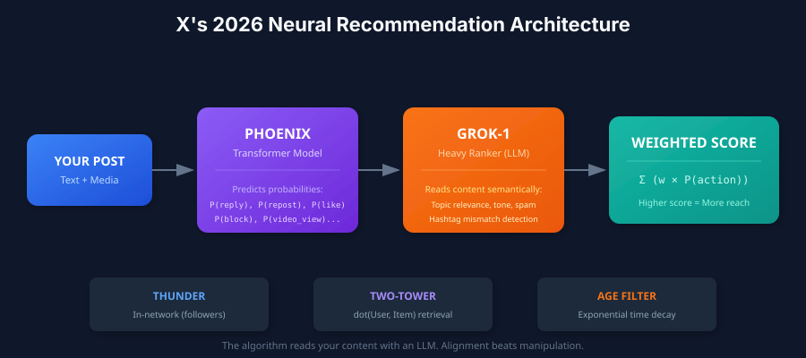
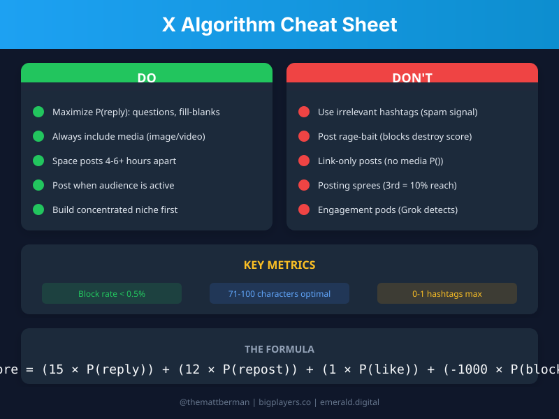

# X Algorithm Optimizer

**Grounded in X's open-source codebase (`xai-org/x-algorithm`, May 2026 release). Code-confirmed mechanics, with inference clearly labeled.**

> **Updated 2026-05-15.** Re-audited against the May 2026 repo release. Key corrections from earlier versions: scoring weights are private feature-switch params and are NOT in the repo (any specific number is a guess); negative signals use a bounded `offset_score` renormalization, not a `-1000` cliff; the action list is now confirmed (no `bookmark`, no "Show more"; video action is `vqv`); `AgeFilter` is a hard cutoff not exponential decay; new `Grox` content-understanding service + ads blending. See SKILL.md "What Changed (2026-05-15)".

[](https://twitter.com/themattberman)
[](https://bigplayers.co)

---

## The Game Changed in 2026

X abandoned hashtag matching and follower counts. The new system is **fully neural**:

<p align="center">
  
</p>

**Translation:** A Grok-derived transformer predicts how users will engage with your post based on engagement-history patterns, and a separate Grox service classifies spam/safety/quality. Gaming hashtags is dead. Alignment is everything.

---

## The Weighted Scorer (This Is How You Win)

Every post gets a score. The real formula (`home-mixer/scorers/weighted_scorer.rs`, `ranking_scorer.rs`):

```
combined_score = Σ (weight_action × P(action))   // 19 actions, positive and negative
final_score    = offset_score(combined_score)    // bounded renormalization
```

The Phoenix transformer predicts a probability for each of 19 actions. The weights are pulled at request time from X's private feature-switch system — **they are NOT in the open-source repo.** Treat any specific weight number you see anywhere as a guess.

### How scoring actually behaves

- Positive actions (reply, repost, quote, share, favorite, vqv, photo_expand, etc.) add to the score.
- Negative actions (`not_interested`, `block_author`, `mute_author`, `report`, `not_dwelled`) subtract.
- If the sum goes negative, `offset_score` renormalizes it into a small bounded range — a **floor**, not an unbounded `-1000` penalty.

**Correction from earlier versions:** there is no "-1000x block weight" and the worked examples that produced scores like `-15.84` were fabricated. Negative signals still matter a lot — enough of them flip the post into the suppressed bucket — but you cannot compute a literal point cost without X's private weights.

---

## The Mechanics That Control Your Reach

```
┌────────────────────────────────────────────────────────────────────────┐
│                  CODE-CONFIRMED ALGORITHM MECHANICS                    │
├────────────────────────────────────────────────────────────────────────┤
│                                                                        │
│  1. CANDIDATE ISOLATION      Posts scored independently (attn mask)    │
│  2. AUTHOR DIVERSITY         Repeat authors attenuated per feed resp.  │
│  3. NEGATIVE RENORMALIZATION Negatives flip score to suppressed bucket │
│  4. MULTIMODAL BONUS         Media adds photo_expand + vqv terms       │
│  5. OON DEMOTION             Out-of-network posts ×OonWeightFactor (<1)│
│  6. TWO-TOWER RETRIEVAL      User×Item vectors for OON discovery       │
│  7. AGE FILTER               Hard cutoff — posts past max_age dropped  │
│  8. GROX CONTENT SCREEN      Spam / safety / "banger" quality classify │
│                                                                        │
└────────────────────────────────────────────────────────────────────────┘
```

(Note: the Phoenix ranker is a Grok-1-derived transformer over hash-based ID embeddings — it learns from your engagement-sequence patterns, not by "reading" your prose. Natural-language content understanding is the separate Grox service. See SKILL.md.)

---

## Cheat Sheet (Save This)

<p align="center">
  
</p>

<details>
<summary><b>Text version (click to expand)</b></summary>

### DO
- **Maximize P(reply):** Questions, fill-blanks, "hot take + nuance"
- **Always include media:** Adds the photo_expand + vqv (video quality view) action terms
- **Space posts 4-6+ hours:** Author diversity penalty compounds
- **Post when audience is active:** AgeFilter hard-drops posts past max_age; early velocity matters
- **Build a concentrated niche:** Strengthens your User Tower embedding

### DON'T
- **Spammy/low-effort patterns:** Grox spam classifier targets these (esp. low-follower reply spam)
- **Rage-bait:** High blocks destroy score even with high engagement
- **Link-only posts:** Zero media probability terms
- **Posting sprees:** AuthorDiversityScorer attenuates repeat authors within a feed response
- **Engagement pods:** Coordinated low-follower replies are classified as spam by Grox

### TARGET
Minimize not_interested / block / mute / report. Specific block-rate % thresholds are NOT in the repo — treat any number as a rule of thumb.

</details>

---

## High P(Reply) Patterns That Work

These patterns maximize replies — a top-tier network-extending action:

| Pattern | Example | Why It Works |
|---------|---------|--------------|
| **Open question** | "What's your biggest [X] failure?" | Demands specific experience |
| **Fill-in-the-blank** | "The most underrated skill is ___" | Low friction to complete |
| **Intentional incompleteness** | List with obvious gap | People can't resist adding |
| **Nuanced controversy** | "Hot take: [X]. But here's the nuance..." | Invites debate, reduces blocks |
| **Correctability** | Slightly wrong statement | Experts will correct you |

**Anti-patterns:** Rhetorical questions, perfect statements, closed conclusions

---

## Content Optimization Flow

```
                        ┌─────────────────┐
                        │ What's your     │
                        │ goal?           │
                        └────────┬────────┘
                                 │
          ┌──────────┬───────────┼───────────┬──────────┐
          ▼          ▼           ▼           ▼          ▼
     ┌────────┐ ┌────────┐ ┌────────┐ ┌────────┐
     │ Max    │ │Engage- │ │Follower│ │ Safe   │
     │ Reach  │ │ment    │ │Growth  │ │Growth  │
     └───┬────┘ └───┬────┘ └───┬────┘ └───┬────┘
         │          │          │          │
         │   Optimize for:     │          │
         │   P(repost)  P(reply)  P(profile)  Low P(block)
         │          │          │          │
         └──────────┴──────────┴──────────┘
                        │
                        ▼
              ┌─────────────────┐
              │ Apply reply     │
              │ optimization    │
              └────────┬────────┘
                       │
                       ▼
              ┌─────────────────┐
              │ Add media       │
              │ (image/video)   │
              └────────┬────────┘
                       │
                       ▼
              ┌─────────────────┐
              │ Negative signal │
              │ scan (<0.5%     │
              │ block rate?)    │
              └────────┬────────┘
                       │
            ┌──────────┴──────────┐
            ▼                     ▼
       ┌────────┐           ┌────────┐
       │  POST  │           │ Revise │
       └────────┘           └───┬────┘
                                │
                                └──► (back to scan)
```

---

## Platform Quick Reference

| Element | Optimal | Why |
|---------|---------|-----|
| Characters | 71-100 (max 280) | No "Show more" friction |
| Hashtags | 0-1 | Low-effort patterns risk Grox spam classification |
| Images | 1200×675px or vertical | Full preview; vertical forces expand |
| Video | <2:20, hook in 3s, captioned | Autoplay; 80% watch muted |
| Media source | Native upload only | Links don't trigger media P() |

---

## Installation (Claude Code Skill)

This is a **Claude Code skill** that gives Claude deep knowledge of X's algorithm mechanics.

### Install globally:

```bash
# Clone the repo
git clone https://github.com/themattberman/x-algo-skill.git

# Symlink to Claude Code skills directory
ln -s $(pwd)/x-algo-skill ~/.claude/skills/x-algorithm-optimizer
```

### Use it:

Once installed, Claude will automatically use this skill when you ask about:
- X/Twitter optimization
- Post performance debugging
- Algorithm mechanics
- Content strategy for reach

Or invoke directly: `/x-algorithm-optimizer`

---

## What's Included

```
x-algo-skill/
├── SKILL.md                      # Main skill file
├── README.md                     # You're reading it
├── references/
│   ├── phoenix-architecture.md   # Deep dive: Two-Tower, Grok, embeddings
│   ├── weighted-scorer.md        # Complete weight math + examples
│   └── post-templates.md         # 12+ proven formats
└── scripts/
    └── analyze_x_post.py         # Score posts against the algorithm
```

---

## The Meta-Strategy

**Old paradigm:** Game the algorithm (hashtags, timing, pods)

**New paradigm:** Align with the neural network's objective function

The algorithm optimizes for:
1. **Conversation & amplification** — reply, repost, quote, share (top-tier positive actions)
2. **Network extension** — P(repost), P(quote)
3. **User satisfaction** — Negative signals weighted catastrophically
4. **Semantic relevance** — Grok reads everything

**Your strategy:** Create content that genuinely maximizes these. The era of manipulation is over. The era of alignment has begun.

---

## About

Created by **[@themattberman](https://twitter.com/themattberman)** on X.

I write about AI, tech, and business at **[Big Players](https://bigplayers.co)** — a newsletter for people building the future.

Need help with AI strategy? **[Emerald Digital](https://emerald.digital)** — we help companies leverage AI to grow.

---

## License

MIT — Use it, share it, build on it.

---

<p align="center">
  <b>Star this repo if it helped you.</b><br>
  <a href="https://twitter.com/themattberman">Follow @themattberman for more</a>
</p>
